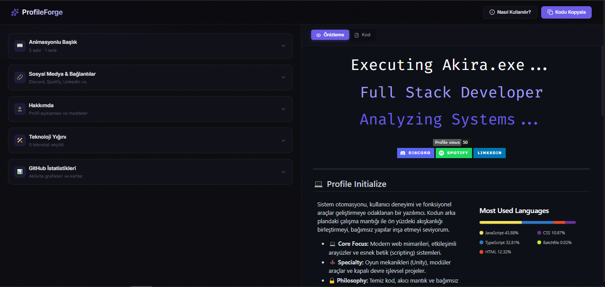

<div align="center">
  <h1>ProfileForge</h1>
  <p><strong>A modern, premium GitHub Profile README generator.</strong></p>
  
  <a href="http://profileforgee.vercel.app/"><strong>🔗 Live Demo: profileforgee.vercel.app</strong></a>
</div>

<br />

## 📸 Preview

<div align="center">
  
</div>

## ✨ Özellikler

- **⌨️ Animasyonlu Başlık (Typing SVG)**: Her satır için ayrı renk, font, hız ve tekrar ayarları.
- **🛠️ Kapsamlı Teknoloji Yığını**: 85'ten fazla teknoloji arasından arama yapın ve tek tıkla profilinize ekleyin.
- **📊 GitHub İstatistikleri**: Aktivite grafikleri, genel istatistikler ve GitHub Streak kartlarını kolayca açıp kapatın.
- **💬 Sosyal Medya & Lanyard**: Discord varlığınızı (Lanyard) canlı olarak profilinize yansıtın; Spotify, LinkedIn ve diğer hesaplarınızı ekleyin.
- **📝 Canlı Önizleme & Düzenlenebilir Kod**: Yaptığınız değişiklikleri anında görün veya Markdown koduna manuel müdahalelerde bulunun.
- **🎨 Premium Dark UI**: Modern, geliştirici dostu, karanlık tema ağırlıklı ve tamamen responsive (mobil uyumlu) bir arayüz.

## 🚀 Kurulum (Local Development)

Projeyi bilgisayarınızda çalıştırmak için aşağıdaki adımları izleyin:

1. Depoyu klonlayın veya indirin.
2. Gerekli paketleri yükleyin:
   ```bash
   npm install
   ```
3. Geliştirme sunucusunu başlatın:
   ```bash
   npm run dev
   ```
4. Tarayıcınızda `http://localhost:5173` adresine gidin.

## 🛠️ Kullanılan Teknolojiler

- **[React](https://reactjs.org/)** - Kullanıcı arayüzü
- **[Vite](https://vitejs.dev/)** - Hızlı derleme ve geliştirme ortamı
- **[Lucide React](https://lucide.dev/)** - Modern ikon seti
- **[React Markdown](https://github.com/remarkjs/react-markdown)** & **Rehype Raw** - Canlı Markdown işleme
